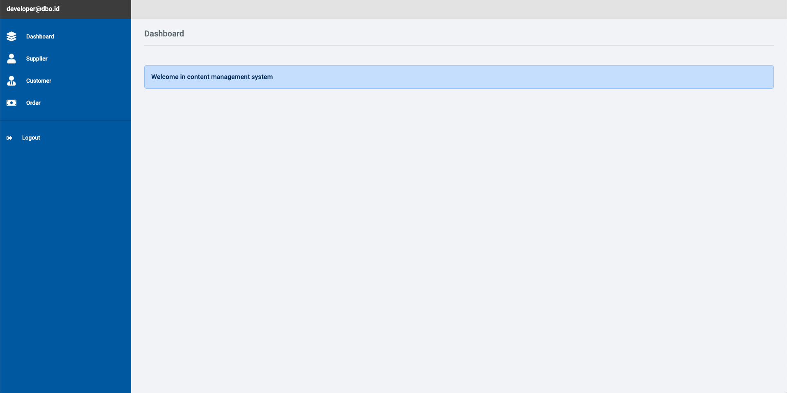
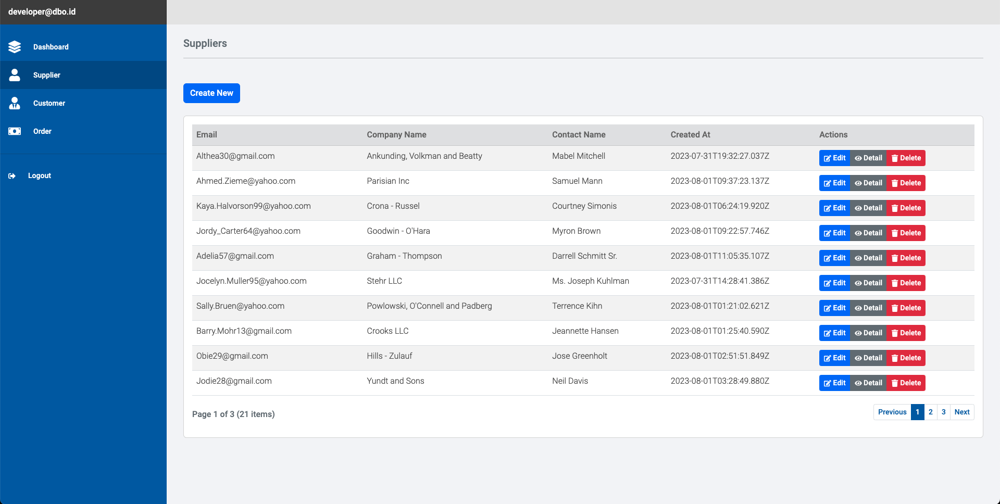
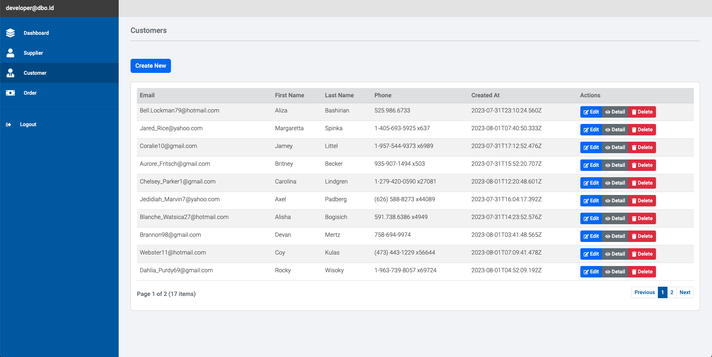
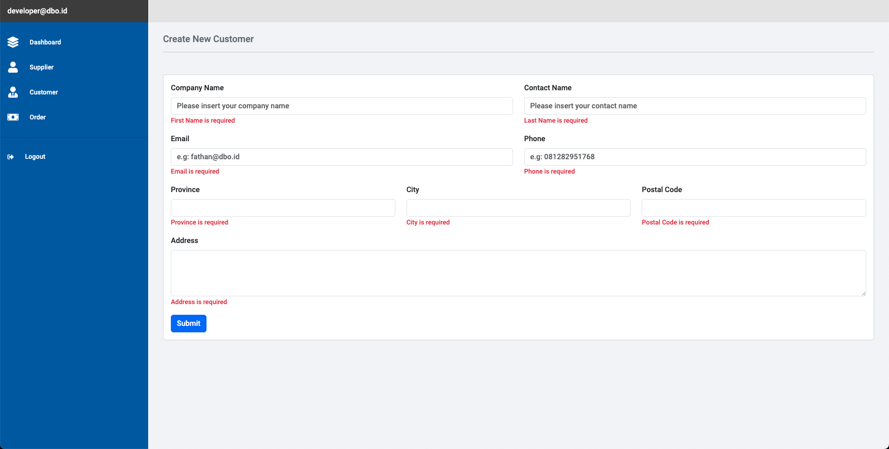
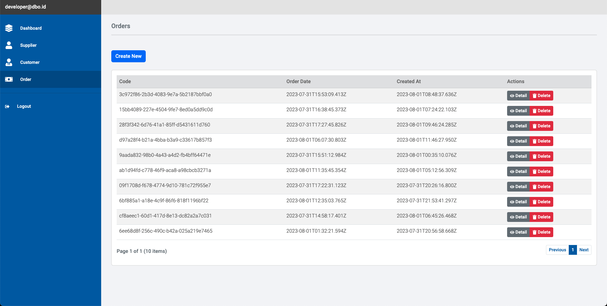

## Project Information


Hello I'm Fathan. this project bootstrapped with [`create-next-app`](https://github.com/vercel/next.js/tree/canary/packages/create-next-app).

----

## Technology Stack

```bash
- TypeScript
- React.js 18
- Next.js 13
- Redux for State Management
- Redux Persist for Persistance Data
- Bootstrap@5.3.1
- iron-session for session store data auth
```

## Getting Started

Docker Build:
```bash
$ COMPOSE_DOCKER_CLI_BUILD=1 DOCKER_BUILDKIT=1 docker-compose build
```

Docker Run:
```bash
$ docker-compose up -d
```

For build to production run:
```bash
$ npm run build
```

For run without docker in local:
```bash
$ npm run dev
```

For run Unit Testing:
```bash
$ npm run test:unit
```

For run Update Snapshot:
```bash
$ npm run test:unit:update-snapshoot
```

Open [http://localhost:3000](http://localhost:3000) with your browser to see the result.

----

## Screenshot projects

## Authentication Login<br>


## Dashboard<br>


## Supplier Management<br>


## Customer Management<br>


## Create New Customer<br>


## Order Management<br>


Thank You,
Fathan 